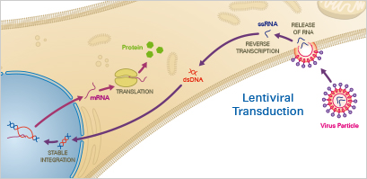

{}

{.mt-5}

{}

{}

HEK stands for human embrionic kidney cells as that is where the cell line was derived. They are used in part because of their reliable growth in culture and for their propensity for transfection. HEK-293 cells are often utilized to produce therapeutic proteins and viruses for gene therapy.

{}

{}

# Lentivirus
{.text-center}

Recombinant lentiviral vectors are powerful tools for gene transfer with some advantages over other delivery vectors: Besides cells that undergo mitosis, they also have the ability to transduce non-dividing cells. Further, lentiviruses enable stable gene transfer in vitro and in vivo, as they integrate into the host cell genome and offer the possibility of positive cell selection. They have a broad host cell range that also includes cell types such as primary neurons, lymphocytes, and macrophages. Moreover, lentiviral vectors have also proven to be effective in transducing brain, liver, muscle, and retina in vivo without toxicity or immune responses. Biosafety level S2 is needed for lentiviral transduction.

{}

{}

  

    

      
    

    

      <h2>Lentiviral Transduction</h2>
      
Lentiviruses—a subclass of retroviruses—have the ability to permanently integrate into the genome of the host cell. After the virus has entered the cell, the viral RNA is transcribed by the reverse transcriptase to produce double-stranded DNA that enters the nucleus. Finally, the transgene is integrated into the host genome via the lentiviral integrase enzymes. When using lentiviral transduction, the user has to take into account effects caused by genomic integration.

      </ul>
      <a href="https://ibidi.com/content/264-viral-transduction#lentiviral_transduction" class="btn btn-primary">Learn More</a>
    

  

{}

{}

# Production of Lentiviral Vectors
HEK293T cells can be adapted to suspension growth in serum-free medium which is of particular interest for large-scale vector productions.

Since attachment of HEK293T cells to culture surfaces is not very strong, vector production is more difficult to perform in roller bottles and transfection conditions in these devices have to be carefully optimized for keeping cells attached. In this context, Patel et al. could show that the overexpression of alpha-v and beta-3 integrin by HEK293 led to an increased cell adhesion allowing efficient LV vector production in roller bottles. However, this approach requires the use of recombinant HEK293 cells overexpressing integrin.

# Method

Very recently a semi-“large-scale” LV vector production system based on the use of hollow fibers has been presented. The hollow fibers are seeded with HEK293T cells, which are then transfected with three plasmids after attachment for 24 hours. The advantage consists in the fact that it is a closed, fully automated culture system with an LV yield equivalent to three CF-10 stacks. This, however, requires that several parallel systems have to be set up for real larger scale productions.
In the case of HEK293T cells, expansion, transfection, and lentivirus production have been demonstrated at 50-l scale in single-use bioreactors.

For optimal transfection of several HEK293-derived cell lines, the cell density appears to be a critical parameter. Many papers converge towards values around 1 million cells/ml, more precisely between 8 × 105 cells/ml and 1.5 × 106 cells/ml, to proceed to the addition of the PEI/DNA polyplexes. 

**What is holding large-scale production back?**

The major bottleneck in urge of optimization is the transfection procedure itself that requires massive amounts of plasmid DNA and consequently makes the production process extremely costly. An industrial-friendly transfection technology consuming less DNA and increasing the percentage of producing cells will be the key element to render such a process profitable for industries in the future.

{.text-center}
{}